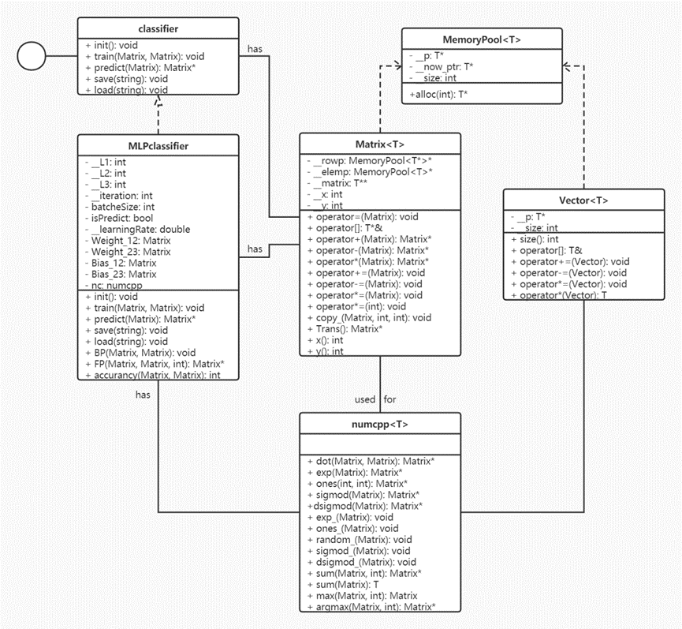

# 从零实现的 C++ MLP

## 概述

本项目主要实现了 `MLPclassifier.h` 的编写，但由于编写此头文件使用了大量的矩阵运算，因而本项目也实现了一个较为好用的矩阵类，并且编写了 demo 演示。

## `Matrix<T>` 使用手册

使用时，需要指定模板类型，当然也可以嵌套使用，例如 `Matrix<Matrix<double>>`，下面举例说明其使用方法：（包含头文件 `utils.h`）

首先，定义一个Matrix，例如：

```cpp
Matrix<double> A(10, 10);
```

这样就创建了一个行列均为 `10` 的矩阵 `A`，下面可以通过 `A[1][2]` 访问 `A` 中的元素。注意，本项目中的 `Matrix<T>` **并不会检测下标越界**，因此请保证下标不会越界！（检测后程序运行速度明显减慢）

已经实现的函数包括，矩阵元素的加法，乘法，减法，矩阵的点乘，下面给出详细的使用方法：

定义 `numcpp`：

```cpp
numcpp<double> nc;
auto D = A + B; // assert(A.__x == B.__x && A.__y == B.__y)
A += B;  // assert(A.__x == B.__x && A.__y == B.__y)
auto C = nc.dot(A, B); // assert(A.__y == B.__x)
```

`C` 即为 `A`，`B` 点乘后的结果，当然需要注意的是，使用结束后，需要使用 `delete C;` 删除分配给 `C` 的空间。其余函数使用同理，能够使用的函数列表如下：

|               **函数**               |                   **作用**                   |
| :----------------------------------: | :------------------------------------------: |
| `=`，`-=`，`+=`，`*=`，`-`，`+`，`*` |                 基本算术运算                 |
|             `A.Trans()`              |              `A`的转置，新矩阵               |
|            `nc.dot(A, B)`            |             `A`、`B`点乘，新矩阵             |
|             `nc.exp(A)`              |          `A`每个元素求`exp`，新矩阵          |
|           `nc.ones(x, y)`            |            生成`x*y`的全为`1`矩阵            |
|            `nc.sigmod(A)`            |        `A`每个元素求`sigmod`，新矩阵         |
|           `nc.dsigmod(A)`            |      `A`每个元素求`sigmod`导数，新矩阵       |
|             `nc.exp_(A)`             |              `A`每个元素求`exp`              |
|            `nc.ones_(A)`             |             `A`每个元素赋值为`1`             |
|           `nc.sigmod_(A)`            |            `A`每个元素求`sigmod`             |
|           `nc.dsigmod_(A)`           |          `A`每个元素求`sigmod`导数           |
|           `nc.random_(A)`            |              `A`每个元素随机化               |
|            `nc.sum(A, 0)`            |     `A`按行求和，第二个参数为`1`表示按列     |
|             `nc.sum(A)`              |            `A`求和，返回类型为`T`            |
|            `nc.max(A, 0)`            |   `A`按行求最大值，第二个参数为`1`表示按列   |
|          `nc.argmax(A, 0)`           | `A`按行求最大值下标，第二个参数为`1`表示按列 |

## `MLPclassifier` 使用手册

使用时，需要先实例化，然后即可使用。（包含头文件 `cppMLP.h`）

具体而言：

```cpp
MLPclassifier Solve(I1, I2, I3, learning_rate, iterations, isPredict);
```

这样就实例化了一个第一层维数为 `I1`，第二层维数为 `I2`，第三层维数为 `I3` 的模型，并且学习率为 `learning_rate`，迭代次数为 `iterations`。`isPredict` 用于决定模型是否在训练时输出预测信息。

在实例化后，就可以使用对应函数完成相应任务：例如使用

```cpp
Solve.init();
```

完成对模型内存分配，权重值初始化的工作。

使用

```cpp
Solve.train(trainingData, trainingLabel);
```

完成模型对数据的训练，其中必须满足的是：训练集中 `trainingData` 的列数必须等于第一层维数，`trainingLabel` 的可选取值必须为`0~第三层维数减一`，并且其列数必须为`1`。行数要求 `trainingData` 与 `trainingLabel` 相同。

使用

```cpp
auto predictLabel = Solve.predict(testData);
```

即可使用模型进行预测，预测后的数据标签保存到 `predictLabel` 中，注意后续必须使用 `delete predictLabel;` 否则会内存泄漏！`testData` 的行数无要求，但列数需要与第一层维数相同。

使用

```cpp
int similarity = Solve.accurancy(predictLabel, testLabel);
```

即可输出 `predictLabel` 与 `testLabel` 的相同元素的个数，也就可以得到 `predict` 的准确率。

使用

```cpp
Solve.save([path])
```

`path`可选，可以将模型参数写入到 `path` 文件中，方便以后读取使用。默认 `path` 为本目录的 `param.data`

使用

```cpp
Solve.load([path])
```

`path` 可选，可以将 `path` 文件中的参数读入到 `model` 中，方便后续调用。默认 `path` 为本目录的 `param.data`

上述即为 `MLPclassifier` 的使用，由于使用了 `class` 包装，其调用显得尤为方便。

 

写给开发者：

对于目前的 classifier，尚有不完善之处，如果需要补充新的 classifier，那么请直接继承 `classifier` 类，然后重载所有纯虚函数，即可。具体来说，如果要编写 `SVMclassifier`，那么请：

```cpp
class SVMclassifier : public classifier {…}
```

其中需要实现的函数参见设计手册，实现完成后，也可以类似上述进行调用：

```cpp
SVMclassifier Solve(init params);
Solve.init(); Solve.train(trainingData, trainingLabel)……
```

这样，也可以看出其使用抽象类的泛用性。

## Demo 使用手册

为了更好地表现 `cppMLP.h` 的实现性能，因此编写了本 demo，下面就其进行说明。

本 demo 是一个命令行工具，在 workingDir 下打开命令提示符，输入：

```bash
CPlusPlusDeepLearning.exe -tps
```

即可以默认参数运行本程序，观察其训练，预测，保存过程。

此后你可以使用：

```bash
CPlusPlusDeepLearning.exe -lp
```

查看其读取，预测的过程。

当然，你随时可以使用：

```bash
CPlusPlusDeepLearning.exe -h
```

或者使用 `--help` 或 `-?` 来获取简略的软件帮助。

软件输出的帮助如下：

```bash
Usage: ./CPlusPlusDeepLearning.exe [-tpsl?hV] [-i <num>] ...
Options
 -h -?                      Print this help message.
 -V                         Print the verison.
 -t                         train the model.
 -p                         predict with the model.
 -s                         save the model.
 -l                         load the model.
 -i <num>                   define the iterations.
 -r <num>                   define the learning_rate.
 --help                     Print this help message.
 --version                  Print the verison.
 --train                    train the model.
 --predict                  predict with the model.
 --save                     save the model.
 --load                     load the model.
 --iterations <num>         define the iterations.
 --learning_rate <num>      define the learning_rate.
 --save_file <file>         define save path.
 --load_file <file>         define load path.
 --train_file <file>        define train path.
 --predict_file <file>      define predict path.
 --train_dimensions <num>   define train dimensions.
 --hidden_layers <num>      define hidden layers
 --output_dimensions <num>  define output dimensions.
 --train_rows <num>         define train rows.
 --predict_rows <num>       define predict rows.
```

Examples:

```bash
CPlusPlusDeepLearning.exe -t --hidden_layers 100 -s
CPlusPlusDeepLearning.exe -l -p
```

下面，解释如何使用参数控制该 demo：

使用 `-h`、`-?`、`--help` 查看软件帮助。

使用 `-V`、`--version` 查看软件版本号。

基本 Tasks 共有4项，Load，Train，Predict，Save，分别由短命令 `-l`、`-t`、`-p`、`-s` 表示。也可使用长命令 `--load`、`--train`、`--predict`、`--save` 控制。

当有这些参数时，表示程序需要做这些操作。

此后是一些文件读取的参数：`--save_file <file>`、`--load_file <file>`、`--train_file <file>`、`--predict_file <file>` 这些选项后必须接参数，分别表示保存路径，读取路径，训练集路径，预测集路径。

此后有一些训练的参数控制：例如两个常用的学习率和迭代次数可以使用 `-r <num>`、`-i <num>` 或长命令 `--learning_rate <num>`、`--iterations <num>` 控制。

对于一些其他参数，下面给出一些解释：`--train_dimensions <num>`、`--hidden_layers <num>`、`--output_dimensions <num>` 分别表示神经网络第一、二、三层神经元个数，`--train_rows <num>` 表示训练集读取行数，`--predict_rows <num>` 表示预测集读取行数。

由于这些参数是可定义的，因此本 demo 不仅适用于手写数字识别，也可用于其他数据集。只要满足 `cppMLP.h` 的需求即可。

## 类图



## 代码统计

|   文件    |   行数   |
| :-------: | :------: |
| main.cpp  |   282    |
|  cppDL.h  |    25    |
| cppMLP.h  |   202    |
|  macro.h  |    25    |
|  utils.h  |   561    |
| **TOTAL** | **1195** |

